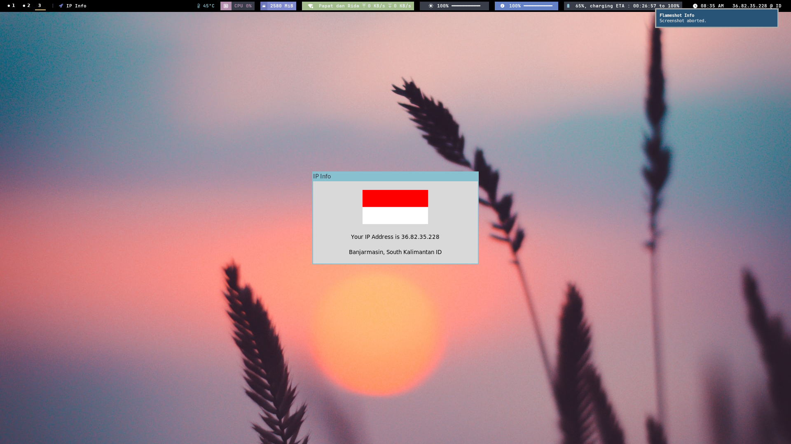

# IPFlag for polybar

## How it look ?




## How to use it ?

- using available bash script

  - if you using debian base os you can use script `install.sh` that i already make for you to cut the hassle.

- building from source.

  - preparing requirements, and building python executable file.
    - first of all you should install `python3`, `python3-tk`, and (if not available) install `python3-venv`.
    - clone this repo.
    - cd to repo folder.
    - run `python3 -m venv env --upgrade-deps && source ./env/bin/activate` for preparing python virtual environment and activate it.
    - run `pip install -r requirements.txt` to install required python library.
    - run `pyinstaller src/main.py -F -w --hidden-import=requests` to building python executable files
  - copy freshly created executable file to your polybar folder.
    - run `chmod +x ./ipflag/label.sh && chmod +x ./ipflag/window.sh`.
    - run `cp ./dist/main ./ipflag/ipflag` to copy python executable from folder `./dist/`.
    - run `cp -R ./ipflag ~/.config/polybar/` to copy ipflag folder to your `./config/polybar/` folder. Now this is actually depending on where you like to put your polybar plugin, inside folder `./ipflag/` there is containing file `label.sh` and `window.sh` that i already created for showing your ip address (inside `label.sh`) @ polybar, and executable script that will run your gui mode when you click the ip text in polybar (inside `window.sh`). If you have your own preference where you usually put your polybar plugin, maybe you want to change a little bit of script in `label.sh` and `window.sh`.
  - Configuring polybar `modules.ini` / `config.ini`.

    - inside your `config.ini` or `modules.ini` file add new line containing this config.

    ```
    [module/ipflag]
    type = custom/script
    interval = 30
    exec = ~/.config/polybar/midnight/ipflag/label.sh
    click-left = ~/.config/polybar/midnight/ipflag/window.sh
    label = "%output%"

    ```

    - for `interval` i'm recommend to leave it as default because `ipinfo.io` will limit you if you set it below 15.

## Note

feel free to costumize and improving this plugin however you like, also feel free to create issue if needed. :D
